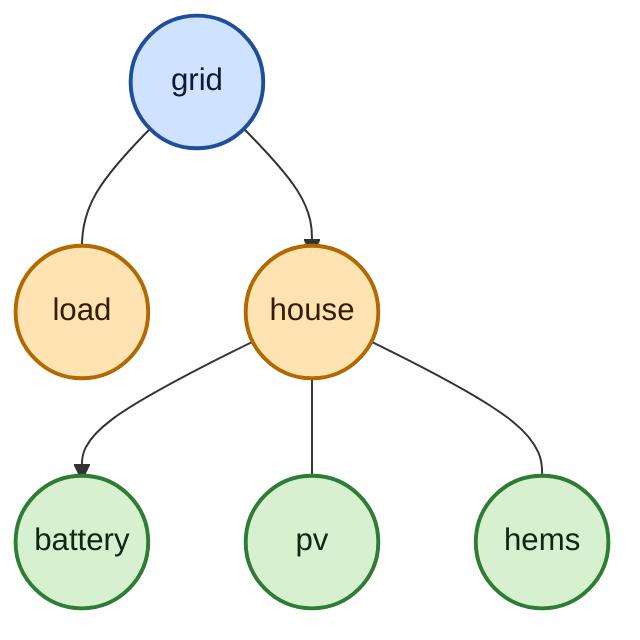

# GridLock

A containerized, config-driven [HELICS](https://docs.helics.org/) co-simulation platform for power grids and households to research the effects of Home Energy Management Systems (HEMS) on the grid.

One experiment YAML describes a grid and everything placed on it.
A generator container turns that description into a complete federation — HELICS publications and subscriptions, CoSim Toolbox metadata, and a `docker-compose.yaml` — and the simulation runs as a set of containers, one per federate.
Nothing about the topology is wired by hand, so an experiment is reproducible from its config file and the commit it ran at.

## Concept

Each federate class is a separate Docker image, and federates communicate **only** through HELICS publications and subscriptions.
Class-specific behaviour lives inside the image; experiment-specific configuration is generated.
A run resolves its grid first (from a local pandapower workbook or from an external InfDB instance by postcode), then generates the federation, then simulates.

Results are written to a time-series database and tagged with a timestamped scenario name; the git commit and the full experiment YAML that produced them are stored with that scenario in the metadata database.

## Federate classes

| Class | Image | Role |
|---|---|---|
| `grid` | `federates/grid` | pandapower power flow; applies the loads it receives and publishes bus voltages |
| `load` | `federates/house_player` | replays an electrical load profile from CSV onto one or more grid loads |
| `house` | `federates/house` | simulated building — thermal model, heat pump, AC, battery, PV (via [EnergySim](https://github.com/Hosseini97/EnergySim)) |
| `hems` / `controller` | `federates/controller` | model-predictive home energy management; commands a house's battery |
| `pv`, `battery` | `federates/house` | declared as sub-federates of a house; their physics currently runs inside the house simulator |
| — | `federates/broker` | the HELICS broker every federation needs |
| `recorder` | `federates/recorder` | `helics_recorder` capture; a leftover of the legacy config format, not usable from a tree experiment — results come from the CST time-series store |
| — | `federates/template` | starting point for a new federate class |

Supporting containers: `composegen/` generates the federation and the compose file, and `databases/infdb/` resolves grids into the metadata store before it runs.

## Tech stack

| Component | Technology | Version |
|---|---|---|
| Co-simulation | HELICS | 3.6.1 |
| Federate framework | [CoSim Toolbox](https://cst.readthedocs.io/en/stable/) (CST) | 1.0.1 |
| Grid modelling | pandapower | 3.3.2 |
| Building simulation | EnergySim (JAX, Equinox) | pinned commit |
| Grid data source | InfDB | external instance |
| Metadata store | MongoDB (or JSON files) | 8.0.7 |
| Time-series store | TimescaleDB / PostgreSQL | pg12 |
| Config generation | PyYAML, treelib, OmegaConf | — |
| Orchestration | Docker Compose | v2+ |
| Language | Python | 3.11 (federates), 3.12 (infdb) |
| Formatting | black, ruff, mypy | via pre-commit |

## Requirements

- Docker with Compose v2 (Linux, macOS, or Windows with WSL2)
- Credentials for an InfDB instance — only if you use location-based grids; experiments with a local grid workbook do not need them

No Python installation on the host is required to run an experiment; the helper scripts in `tools/` are the exception, since you run those yourself.

## Quick start

```bash
cp config/preflight.env.example config/preflight.env   # then fill in your values
./run.sh config/experiment-local-grid.yml
```

`config/experiment-local-grid.yml` runs entirely from a local grid workbook, so it works without InfDB access.
`config/experiment-LV.yml` (the default when you pass no argument) resolves its grid from InfDB by postcode.

Useful flags:

```bash
./run.sh --timeout 600 config/...yml   # abort the simulation if it overruns
./run.sh --cleanup-dbs config/...yml   # stop the databases on exit (they stay up by default)
./run.sh --help
```

Windows users run `run.ps1` instead, which takes the same arguments and runs the same four stages.

Tear a run down with:

```bash
docker compose -f generated/docker-compose.yaml down --remove-orphans
```

## How it works

`run.sh` executes four stages, each gating the next:

1. **Databases** — start TimescaleDB and MongoDB, the two CST stores.
2. **infdb** — resolve the experiment's grid, from InfDB or a local workbook, and write the pandapower net into the metadata store.
3. **composegen** — read the experiment YAML, place every federate on the grid, wire the HELICS keys, and write the CST federation plus `generated/docker-compose.yaml`.
4. **Simulation** — bring up the generated compose file: a broker and one container per federate. Any federate exiting non-zero fails the whole run.

### Inside the generator

Stage 3 is where a description becomes a configuration, so it is built as a small ETL — extract, transform, load — with one module per phase.

- **Extract** (`composegen/extract.py`) reads the experiment YAML and parses the federation into a tree.
- **Transform** (`composegen/transform.py`) validates that tree, normalises the times, and derives which federate publishes what to whom.
- **Load** (`composegen/load.py`) places the federates on the grid's loads, registers the HELICS keys, and writes the CST federation and the compose file.

The point of the split is that the first two phases only read.
Everything the run produces, and every write to a database, happens in load — so a misconfigured experiment is rejected before there is a container or a stored document to clean up.
That is also why the generator is deliberately strict: it would rather refuse to start than fill in a value it cannot know.

## Configuring an experiment

An experiment is a tree: a grid, and the federates placed on it.



Each bubble is a federate: the grid is the root, a `load` player and a `house` are placed on the grid's pandapower load indices, and a house's own devices and its HEMS sit inside that house.

```yaml
general:
  name: "TestGrid"
  start_time: 0
  end_time: 86400        # seconds
  time_step: 3600        # whole seconds
  use_meta_db: "mongo"   # or "json"
  use_data_db: "postgres"
federation:
  id: "local-grid"
  name: "Local Pandapower Grid"
  class: "grid"
  config:
    layout: "kerber_landnetz_freileitung_1.xlsx"   # or: location: [{plz: 91359, ...}]
  sub_federates:
    - id: "loadhouse_0"
      name: "Load profile house"
      class: "load"
      config:
        placement: "fill"                # every load not claimed by a sibling
        electrical_load: "sample_house.csv"
    - id: "house_0"
      name: "sim house"
      class: "house"
      config:
        placement: [4, 6]                # specific pandapower load indices
        exogenous_data: "sample_data.csv"
        model: { class: "1R1C", resistance: "5 Ohm", capacitance: "8 F" }
      sub_federates:
        - id: "battery_0"
          name: "BYD Battery"
          class: "battery"
          config:
            capacity: "5 kWh"
            power: "5 kW"
        - id: "pv_1"
          name: "Sunwell PV"
          class: "pv"
          config:
            capacity: "5 kW"
            max_production: "renewables_ninja2019_munich.csv"
        - id: "hems_0"
          name: "Smart HEMS"
          class: "hems"
          config:
            control_strategy: "mpc"
            accessible: ["battery_0", "pv_1"]
```

`placement` accepts a load index, a list of them, or `"fill"`.
A house is expanded into one federate per load index it occupies; a load player stays a single federate covering all of its indices.
Input CSVs and grid workbooks live in `data/input/`.
Every timeseries CSV must cover the full simulated duration — composegen checks this up front and refuses to start otherwise, rather than letting a federate replay its last known value once the data runs out.

> **The physical parameters above do not reach a federate yet.**
> `model`, `capacity`, `power`, `max_production`, `control_strategy` and `accessible` are validated for presence and then discarded.
> Every house simulates the same hardcoded two-room RC network with a fixed battery and heat pump, whatever the YAML says.
> The topology — which federates exist, where they sit on the grid, and what data they read — is fully config-driven; the device sizing is not.

[`docs/experiment-reference.md`](docs/experiment-reference.md) is the full reference: every key, the required CSV columns per federate class, and the HELICS keys a run writes.

`tools/yaml_graph_tui.py` renders an experiment file as a browsable tree:

```bash
python tools/yaml_graph_tui.py config/experiment-MV-LV.yml
```

## Results

Time-series data is written by the federates into TimescaleDB under a scenario named `<general.name>_<timestamp>`.
The scenario document itself lives in the metadata store, and carries the git commit and a verbatim copy of the experiment YAML, so a stored run can be traced back to what produced it.
Generated artefacts — the compose file, and JSON metadata when `use_meta_db: json` — land in `generated/`.

To inspect the databases, start the optional tooling containers:

```bash
docker compose --env-file config/preflight.env -f docker-compose.preflight.yaml \
  --profile cst-tools up -d      # pgadmin :5050, mongo-express :8081, grafana :3000
```

## Repository layout

```
composegen/    Federation and compose-file generator (extract → transform → load)
config/        Experiment YAMLs and the preflight environment file
data/input/    Grid workbooks and timeseries CSVs
databases/     CST database stack (cstdb) and the InfDB grid resolver (infdb)
docs/          Experiment reference and archived issue lists
federates/     One directory per federate class, each with its own Dockerfile
generated/     Generated compose file and metadata (git-ignored)
tools/         Standalone helper scripts
```

## Contributing

Branch off `main` as `<issue-number>-<slug>` and merge through a pull request.
Format with black and ruff (line length 88) before committing; `.pre-commit-config.yaml` has the exact hooks.

Architecture details, invariants, and conventions for working in this codebase are in [`AGENTS.md`](AGENTS.md).
